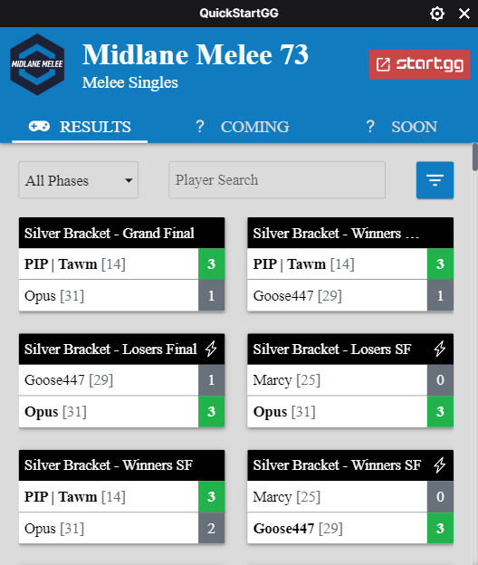
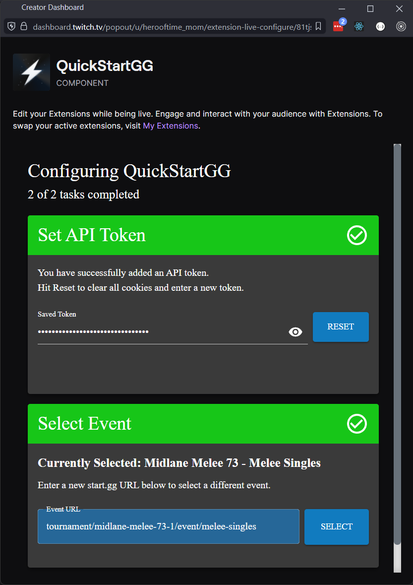
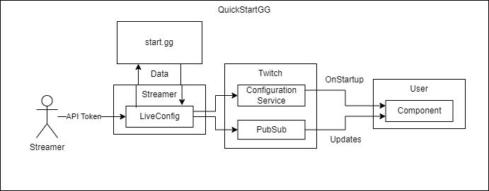

# QuickStartGG Twitch Extension

This Twitch extension allows streamers to add a tournament info component powered by StartGG data to their stream.

Here is a screenshot of the component from the viewer's perspective:

## Streamer Setup

The streamer is required to provide two configs:

1. A StartGG api token (requires account registration on [start.gg](https://start.gg/admin/profile/developer))
2. A tournament identifier (the url of a tournament on the website)

Both of those inputs are configured and validated in the live configuration panel.

> NOTE: This extension runs entirely on the streamers computer and does not utilize an Extension Backend Service. This means that the Live Config window must be kept open to continue periodically refreshing data.

## Implementation details

This extension is a React app built around a central Redux store and a
MaterialUI frontend. There are two pieces: the streamer's live config view, and
the viewer's component view.

### Live Config View

The live config view powers the extension. It is responsible for:

- Loading all available data from StartGG on startup
- Storing a filtered and compressed version of the data in the Configuration Service
- Polling StartGG for updates
- Publishing incremental results

When new results are returned from the StartGG query, they are added to the
Redux store. The app then takes a snapshot of the most "interesting" (mostly
determined by phase of the tournament) results, compresses the snapshot, and
writes it to Twitch's Configuration Service. This snapshot is used to populate
the viewer's initial view. The incremental results are then published to
Twitch's PubSub for existing viewers.

### Component View

The component view is responsible for displaying the data to the user. On startup, it pulls the latest snapshot from the configuration service and then registers a listener with pubsub for incremental updates.

From there, the component tries to capture the most common views that users
would be interested in, such as:

- Most recent results
- Upsets
- Specific player results
